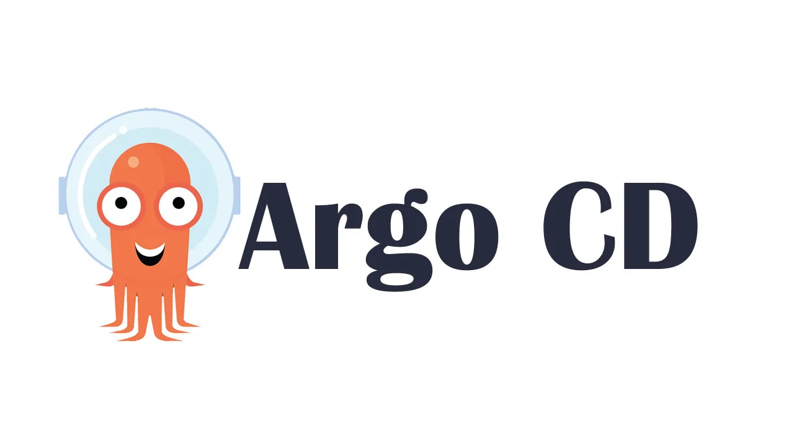

# ArgoCD Labs

## Content
* [Install ArgoCD](LAB/Install_ArgoCD_.md)
* [Access to ArgoCD server via UI](LAB/Access_to_ArgoCD_server_via_UI.md)
* [Install ArgoCD CLI](LAB/Create_application_from_CLI.md)
* [Create application declaratively with yaml](LAB/Create_application_declaratively_with_yaml.md)
* [Create application from CLI](LAB/Create_application_from_CLI.md)
* [Create application from UI](LAB/Create_application_from_UI.md)
* [HELM](LAB/HELM.md)
* [Directory of files](LAB/Directory_of_files.md)
* [Kustomize](LAB/Kustomize.md)
* [Create projects](LAB/Create_projects.md)
* [Create projects with role](LAB/Create_projects_with_role.md)
* [Use private git repo using https/ssh](LAB/Private_git_repo.md)
* [Tracking strategies Git tag/Git SHA](LAB/Tracking_strategies.md)
* [Diff customization](LAB/Diff_customization.md)
* [Hooks resources](LAB/Hooks_resources.md)
* [Sync Wavews](LAB/Sync_Wavews.md)